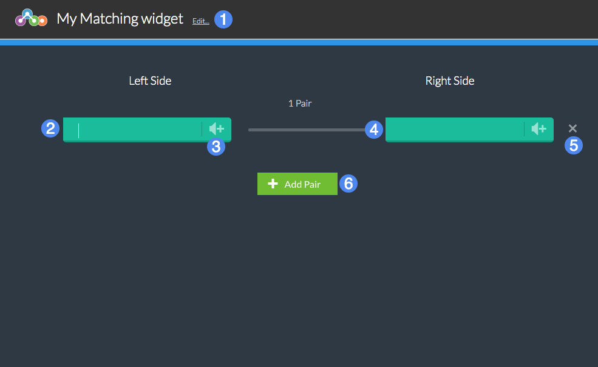

# Overview #

Students must match one set of words or phrases to a corresponding word, phrase, or definition. Matchable terms may also include an optional audio track.

1. Title of the widget
2. Left-hand term to be matched
3. Add an optional audio track
4. Corresponding right-hand term to be matched
5. Remove this pair
6. Add another pair of matched terms

## Details ##

Students will be asked to matched terms on the left side with their corresponding terms on the right side. In the Matching Player, terms on each side will be shuffled randomly.

For each pair, provide a word or phrase on the left side and its corresponding word or phrase to be matched on the right side. Use the **Add Pair** button (6) to add a new pair of terms.

### Adding Audio ###

Individual terms can also provide an optional audio track to accompany a word or phrase. Select the Audio button (3), then use the media upload interface to upload an audio file on your computer to Materia. Note that audio tracks are associated with an individual term, and the matching term on the other side does not require an audio component as well.

