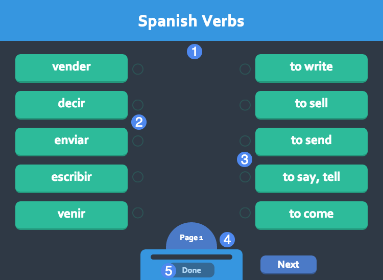

# Overview #
Students must match one set of words or phrases to a corresponding word, phrase, or definition. Matchable terms may also include an optional audio track.

1. Title of the widget
2. Left-hand set of matchable terms
3. Right-hand set of matchable terms
4. Pagination controls
5. Done button

## Details ##

### Matching ###

Match terms on one side with their corresponding terms on the other side. Click a term to select it, then click the corresponding term on the opposite side to complete the match. Matched terms are greyed out and linked with a line to visualize that they are matched.

If the widget includes more than five total terms, the terms will be sorted across several pages: use the pagination controls (4) at the bottom to navigate between pages. Terms are only matched with terms on the same page. A progress bar above the done button will fill as terms are matched, to indicate progress.

Some terms may include an audio track in addition to, or instead of, text. Listen to the audio track, if present, and then select the corresponding term on the other side.

### Submitting ###

When you've matched every term, the **Done** button will become active at the bottom of the widget (5). Click it to end the widget and receive a score.